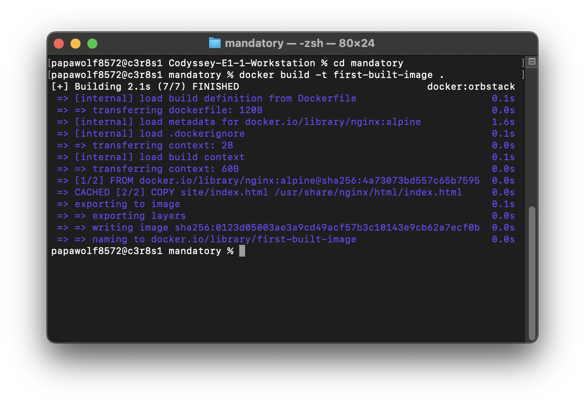
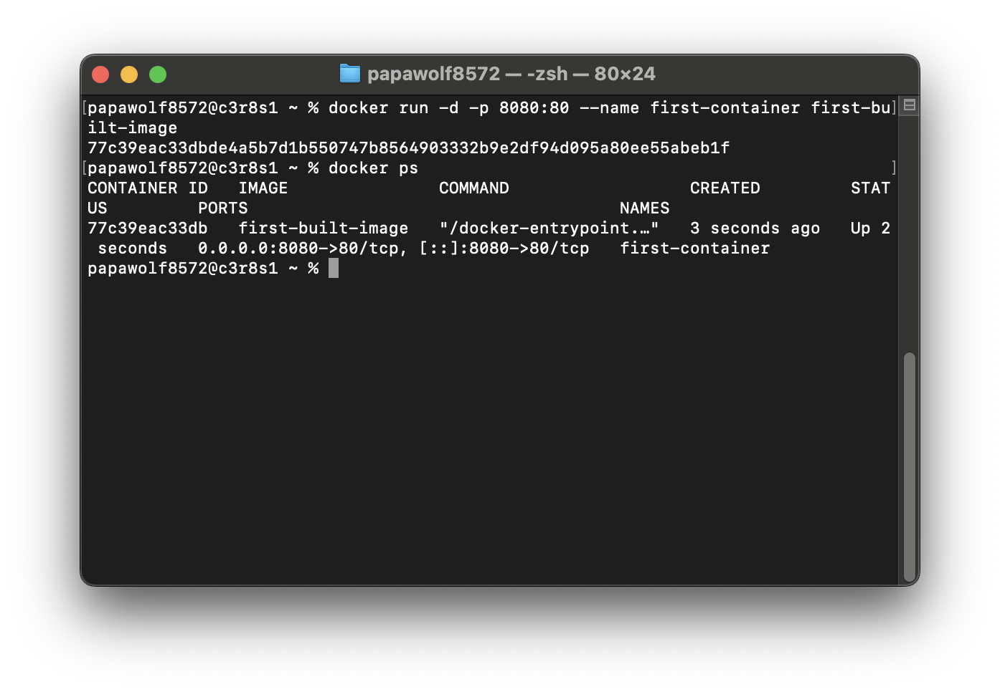
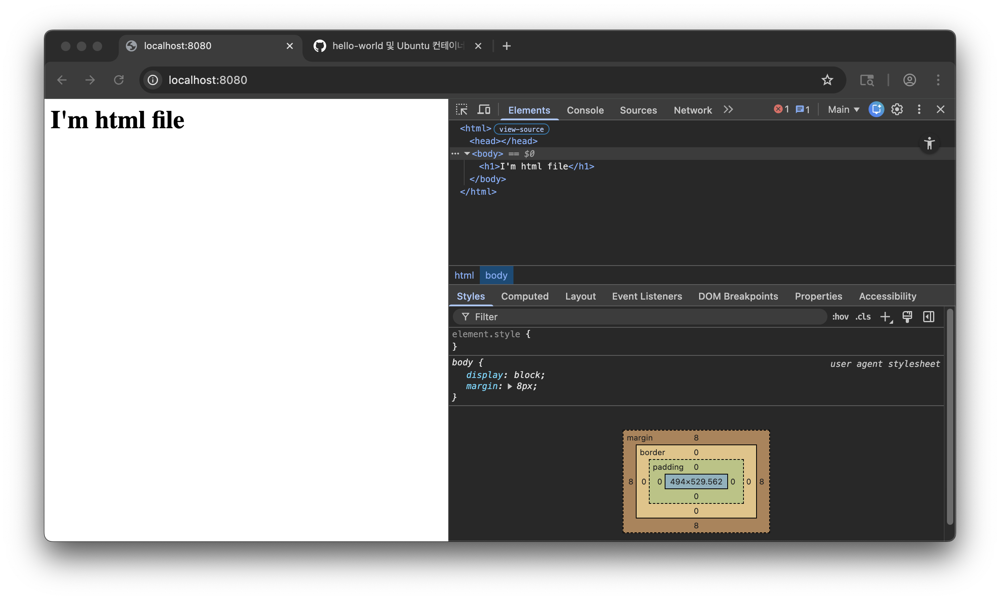
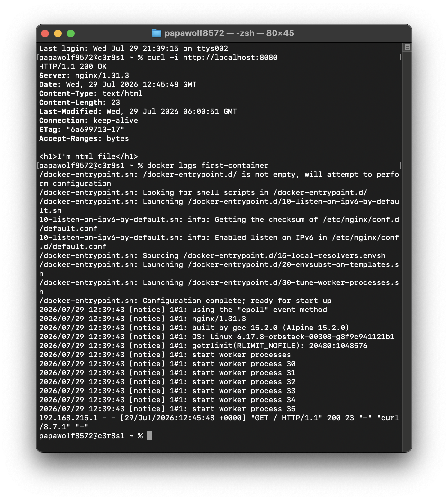
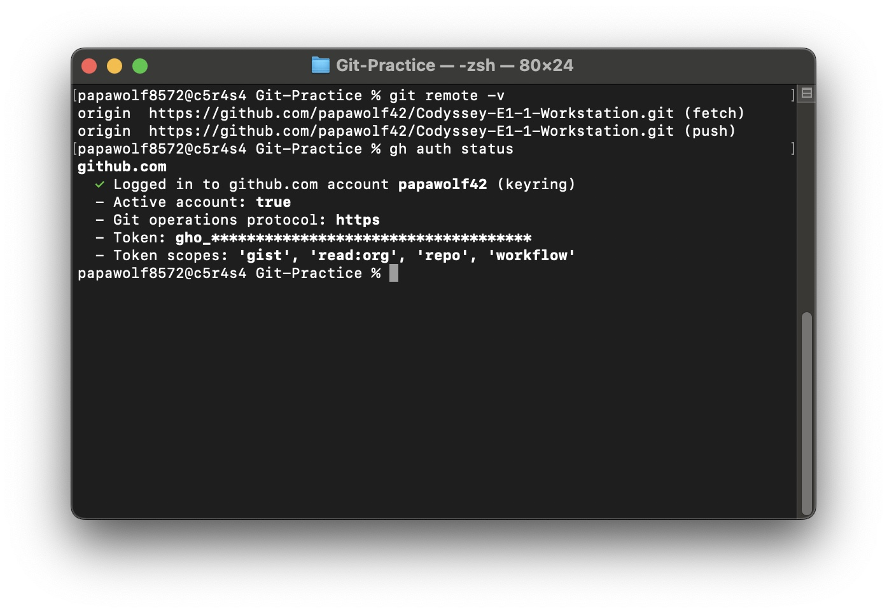

# Codyssey E1-1 Workstation — 필수 체크리스트

## 1) 프로젝트 개요

이 미션은 터미널, Docker, Git/GitHub를 이용해 개발 환경을 구성하고, 그 과정을 재현 가능한 형태로 정리하는 작업이다. 터미널에서는 작업 디렉토리와 파일, 권한을 관리하고 Docker에서는 이미지와 컨테이너를 실행한다.

Dockerfile로 간단한 웹 서버를 구성한 뒤 포트 매핑으로 접속을 확인한다. 바인드 마운트로 호스트의 변경 사항이 컨테이너에 반영되는지 확인하고, Docker 볼륨으로 컨테이너를 삭제한 뒤에도 데이터가 유지되는지 확인한다. 수행한 명령과 결과는 README에 기록해 다른 환경에서도 같은 절차를 따라 실행할 수 있도록 한다.

## 2) 실행 환경

- OS: macOS Sequoia 15.7.4(Darwin)
- Shell: zsh
- Docker: 28.5.2, build ecc6942
- Docker daemon: OrbStack 2.0.5
- Git: 2.53.0
- Editor: VS Code 1.112.0

## 3) 수행 체크리스트

- [x] 터미널 기본 조작 및 폴더 구성
    - [x] 현재 위치 확인 — `pwd`
    - [x] 목록 확인(숨김 파일 포함) — `ls -la`
    - [x] 디렉토리 이동 — `cd <directory>`
    - [x] 디렉토리·파일 생성 — `mkdir`, `touch`
    - [x] 파일 내용 확인 — `cat <file>`
    - [x] 파일 복사 — `cp <source> <destination>`
    - [x] 파일 이동·이름 변경 — `mv <source> <destination>`
    - [x] 파일·디렉토리 삭제 — `rm`, `rmdir`
    - [x] 빈 파일 생성 — `touch <empty_file>`
    - [x] 명령어와 출력 결과 기록

- [x] 권한 변경 실습
    - [x] 파일 1개의 권한 확인 및 변경 — `ls -l`, `chmod`
    - [x] 디렉토리 1개의 권한 확인 및 변경 — `ls -ld`, `chmod`
    - [x] 변경 전·후 비교 기록
    - [x] `r/w/x`, `755`, `644`의 의미 설명

- [x] Docker 설치/점검
    - [x] Docker 실행 환경 확인 — 서울 환경: OrbStack
    - [x] Docker 버전 확인 — `docker --version`
    - [x] Docker 데몬 동작 여부 확인 — `docker info`
    - [x] Docker CLI와 데몬이 정상적으로 연결되는지 확인

- [x] Docker 기본 운영
    - [x] 이미지 다운로드 및 목록 확인 — `docker pull`, `docker images`
    - [x] 컨테이너 실행·중지·목록 확인 — `docker run`, `docker stop`, `docker ps`, `docker ps -a`
    - [x] 컨테이너 로그 확인 — `docker logs <container>`
    - [x] 컨테이너 리소스 확인 — `docker stats --no-stream <container>`
    - [x] 기본 운영 명령과 핵심 출력 결과 기록

- [x] hello-world 실행
    - [x] 공식 테스트 이미지 실행 — `docker run hello-world`
    - [x] 실행 성공 결과 기록
    - [x] `ubuntu` 컨테이너 실행 및 내부 진입 — `docker run -it ubuntu bash`
    - [x] 컨테이너 내부에서 간단한 명령 실행 — `ls`, `echo`
    - [x] `attach`와 `exec`의 차이 관찰 — `docker attach`, `docker exec`
    - [x] 컨테이너 종료·유지 방식의 차이 정리

- [x] Dockerfile 빌드/실행
    - [x] 커스텀 이미지 제작 방식 선택: 웹 서버 베이스 또는 Linux 베이스
    - [x] 베이스 이미지와 선택 이유 기록
    - [x] 웹 서버 소스코드 작성 — 예: `site/`, `app/`, `src/`
    - [x] Dockerfile 작성 — `Dockerfile`
    - [x] 적용한 커스텀 포인트와 목적 설명
    - [x] 이미지 빌드 — `docker build -t <image>:<tag> .`
    - [x] 커스텀 이미지 실행 — `docker run`
    - [x] 빌드·실행 명령과 핵심 결과 기록

- [x] 포트 매핑 접속
    - [x] 호스트 포트와 컨테이너 포트 연결 — `-p <host_port>:<container_port>`
    - [x] 컨테이너 내부 서비스 포트 확인
    - [x] 브라우저 접속 또는 `curl` 응답 확인 — `curl http://localhost:<host_port>`
    - [x] 브라우저 사용 시 주소창과 응답 화면 기록
    - [x] 포트 매핑이 필요한 이유 설명
    - [x] 포트 매핑 접속 스크린샷 또는 `curl` 결과 기록

- [x] 바인드 마운트 반영
    - [x] 호스트 파일의 변경 전 내용 확인
    - [x] 바인드 마운트로 컨테이너 실행 — `docker run -v <host_path>:<container_path>`
    - [x] 호스트 파일 변경
    - [x] 컨테이너 또는 브라우저에서 변경 반영 확인
    - [x] 실행 명령과 호스트 변경 전·후 결과 기록

- [x] 볼륨 영속성
    - [x] Docker 볼륨 생성 — `docker volume create <volume>`
    - [x] 볼륨을 컨테이너에 연결 — `docker run -v <volume>:<container_path>`
    - [x] 볼륨에 데이터 기록 및 확인 — `docker exec`
    - [x] 컨테이너 삭제 — `docker rm`
    - [x] 같은 볼륨으로 새 컨테이너 실행
    - [x] 새 컨테이너에서 기존 데이터 확인
    - [x] 컨테이너 삭제 전·후 비교 기록
    - [x] Docker 볼륨과 영속 데이터 설명

- [ ] Git 설정 + VSCode GitHub 연동
    - [x] Git 사용자 정보 설정 — `git config user.name`, `git config user.email`
    - [x] 기본 브랜치 설정 — `git branch -m main`, `git config --global init.defaultBranch main`
    - [x] 필요한 Git 설정 결과 기록
    - [ ] VSCode에서 GitHub 로그인
    - [ ] VSCode와 GitHub 저장소 연동
    - [x] GitHub CLI 로그인 및 HTTPS 원격 저장소 등록
    - [ ] 실제 `git push` 성공 확인
    - [x] Git과 GitHub의 역할 차이 설명
    - [x] ID·비밀번호·토큰 등 민감정보 미포함 확인

## 4) 수행 기록

### 4-1) 터미널 기본 조작

```console
$ cd Codyssey-E1-1-Workstation
$ pwd
/Users/papawolf8572/Dev/Codyssey-E1-1-Workstation

$ cd mandatory
$ pwd
/Users/papawolf8572/Dev/Codyssey-E1-1-Workstation/mandatory

$ ls -al
total 16
drwxr-xr-x  3 papawolf8572  papawolf8572    96 Jul 29 14:24 .
drwxr-xr-x  5 papawolf8572  papawolf8572   160 Jul 29 14:24 ..
-rw-r--r--  1 papawolf8572  papawolf8572  5232 Jul 29 14:24 README.md

$ mkdir -p site scratch
$ ls -al
total 16
drwxr-xr-x  5 papawolf8572  papawolf8572   160 Jul 29 14:24 .
drwxr-xr-x  5 papawolf8572  papawolf8572   160 Jul 29 14:24 ..
-rw-r--r--  1 papawolf8572  papawolf8572  5232 Jul 29 14:24 README.md
drwxr-xr-x  2 papawolf8572  papawolf8572    64 Jul 29 14:24 scratch
drwxr-xr-x  2 papawolf8572  papawolf8572    64 Jul 29 14:24 site

$ touch scratch/draft.html
$ ls -al scratch
total 0
drwxr-xr-x  3 papawolf8572  papawolf8572   96 Jul 29 14:25 .
drwxr-xr-x  5 papawolf8572  papawolf8572  160 Jul 29 14:24 ..
-rw-r--r--  1 papawolf8572  papawolf8572    0 Jul 29 14:25 draft.html

$ echo "<h1>I'm html file</h1>" > scratch/draft.html
$ cat scratch/draft.html
<h1>I'm html file</h1>

$ cp scratch/draft.html site/index-copy.html
$ ls -al site
total 8
drwxr-xr-x  3 papawolf8572  papawolf8572   96 Jul 29 14:27 .
drwxr-xr-x  5 papawolf8572  papawolf8572  160 Jul 29 14:27 ..
-rw-r--r--  1 papawolf8572  papawolf8572   23 Jul 29 14:27 index-copy.html

$ mv site/index-copy.html site/index.html
$ ls -al site
total 8
drwxr-xr-x  3 papawolf8572  papawolf8572   96 Jul 29 14:27 .
drwxr-xr-x  5 papawolf8572  papawolf8572  160 Jul 29 14:27 ..
-rw-r--r--  1 papawolf8572  papawolf8572   23 Jul 29 14:27 index.html

$ cat site/index.html
<h1>I'm html file</h1>

$ rm scratch/draft.html
$ ls -al scratch
total 0
drwxr-xr-x  2 papawolf8572  papawolf8572   64 Jul 29 14:28 .
drwxr-xr-x  5 papawolf8572  papawolf8572  160 Jul 29 14:28 ..

$ rmdir scratch
$ ls -al
total 16
drwxr-xr-x  4 papawolf8572  papawolf8572   128 Jul 29 14:28 .
drwxr-xr-x  5 papawolf8572  papawolf8572   160 Jul 29 14:24 ..
-rw-r--r--  1 papawolf8572  papawolf8572  5232 Jul 29 14:24 README.md
drwxr-xr-x  3 papawolf8572  papawolf8572    96 Jul 29 14:27 site
```

### 4-2) 권한 변경 실습

```console
$ docker exec -it first-container /bin/sh
/ # cd /usr/share/nginx/html
/usr/share/nginx/html # pwd
/usr/share/nginx/html
/usr/share/nginx/html # ls -ld .
drwxr-xr-x    1 root     root          4096 Jul 29 22:14 .
/usr/share/nginx/html # ls -l index.html
-rw-r--r--    1 root     root            23 Jul 29 05:37 index.html
/usr/share/nginx/html # chmod 600 index.html
/usr/share/nginx/html # ls -l index.html
-rw-------    1 root     root            23 Jul 29 05:37 index.html
```

```console
$ curl -sS -i http://localhost:8080/ | sed -n '1p'
HTTP/1.1 403 Forbidden
```

```console
/usr/share/nginx/html # chmod 644 index.html
/usr/share/nginx/html # ls -l index.html
-rw-r--r--    1 root     root            23 Jul 29 05:37 index.html
```

```console
$ curl -sS -i http://localhost:8080/ | sed -n '1p'
HTTP/1.1 200 OK
```

```console
/usr/share/nginx/html # chmod 644 .
/usr/share/nginx/html # ls -ld .
drw-r--r--    1 root     root          4096 Jul 29 22:14 .
```

```console
$ curl -sS -i http://localhost:8080/ | sed -n '1p'
HTTP/1.1 403 Forbidden
```

```console
/usr/share/nginx/html # chmod 755 .
/usr/share/nginx/html # ls -ld .
drwxr-xr-x    1 root     root          4096 Jul 29 22:14 .
/usr/share/nginx/html # exit
```

```console
$ curl -sS -i http://localhost:8080/ | sed -n '1p'
HTTP/1.1 200 OK
```

권한 문자열의 첫 글자 `d`는 디렉토리, `-`는 일반 파일을 뜻한다. `r`은 읽기, `w`는 쓰기, `x`는 파일 실행 또는 디렉토리 진입 권한이다.

파일은 `644(rw-r--r--)`에서 소유자만 읽고 쓸 수 있는 `600(rw-------)`으로 변경한 뒤 `644`로 복구했다. 디렉토리는 `755(rwxr-xr-x)`에서 실행 권한이 없는 `644(rw-r--r--)`로 변경한 뒤 `755`로 복구했다.

권한 변경 후 `curl`로 Nginx 응답을 확인했다. `index.html`을 `600`으로 변경하자 Nginx가 파일을 읽지 못해 `403 Forbidden`을 반환했고, `644`로 복구하자 다시 `200 OK`를 반환했다. 파일을 `644`로 유지한 상태에서 디렉토리를 `644`로 변경했을 때도 실행 권한(`x`)이 없어 `403 Forbidden`이 발생했으며, 디렉토리를 `755`로 복구하자 다시 `200 OK`가 반환됐다.

### 4-3) Docker 설치 및 점검

`docker info`는 출력 중 Docker 엔진 동작 확인에 필요한 부분만 발췌했다.

```console
$ docker --version
Docker version 28.5.2, build ecc6942

$ docker info
Client:
 Version:    28.5.2
 Context:    orbstack
 Debug Mode: false

Server:
 Containers: 0
  Running: 0
  Paused: 0
  Stopped: 0
 Images: 0
 Server Version: 28.5.2
 Storage Driver: overlay2
 Kernel Version: 6.17.8-orbstack-00308-g8f9c941121b1
 Operating System: OrbStack
 OSType: linux
 Architecture: x86_64
 CPUs: 6
 Total Memory: 15.67GiB
```

`docker --version`으로 Docker CLI 설치와 버전을 확인했다. `docker info`에서 Client와 Server 정보가 모두 출력되고 Context와 운영체제가 OrbStack으로 표시되므로 Docker CLI가 Docker 엔진과 정상적으로 통신하고 있다.

### 4-4) hello-world 실행

```console
$ docker run hello-world
Unable to find image 'hello-world:latest' locally
latest: Pulling from library/hello-world
4f55086f7dd0: Pull complete
Status: Downloaded newer image for hello-world:latest

Hello from Docker!
This message shows that your installation appears to be working correctly.
```

로컬에 이미지가 없어 Docker Hub에서 `hello-world:latest` 이미지를 내려받은 뒤 컨테이너를 생성하고 실행했다.

```console
$ docker images
REPOSITORY    TAG       IMAGE ID       CREATED        SIZE
hello-world   latest    e2ac70e7319a   4 months ago   10.1kB

$ docker ps
CONTAINER ID   IMAGE     COMMAND   CREATED   STATUS    PORTS     NAMES

$ docker ps -a
CONTAINER ID   IMAGE         COMMAND    CREATED         STATUS                     PORTS     NAMES
b104a6069615   hello-world   "/hello"   3 minutes ago   Exited (0) 3 minutes ago             xenodochial_leakey
```

`docker ps`에는 실행 중인 컨테이너만 표시되므로 결과가 비어 있다. `docker ps -a`에는 종료된 컨테이너도 표시되며, `Exited (0)`은 `hello-world` 컨테이너가 오류 없이 작업을 마치고 종료됐다는 뜻이다.

### 4-5) Ubuntu 컨테이너 실행

Ubuntu 이미지를 내려받고 로컬 이미지 목록에서 확인했다.

```console
$ docker pull ubuntu
Digest: sha256:3131b4cc82a783df6c9df078f86e01819a13594b865c2cad47bd1bca2b7063bb
Status: Downloaded newer image for ubuntu:latest

$ docker images
REPOSITORY    TAG       IMAGE ID       CREATED        SIZE
ubuntu        latest    de7345b16e94   2 weeks ago    100MB
hello-world   latest    e2ac70e7319a   4 months ago   10.1kB
```

`-it` 옵션으로 Ubuntu 컨테이너의 `bash`에 직접 진입해 위치, 파일 목록, 출력과 운영체제를 확인했다.

```console
$ docker run -it --name ubuntu-container ubuntu bash
root@7f7dcfb4839e:/# pwd
/

root@7f7dcfb4839e:/# ls -al
total 16
-rwxr-xr-x   1 root root   0 Jul 29 06:34 .dockerenv
lrwxrwxrwx   1 root root   7 Apr 20 08:46 bin -> usr/bin
drwxr-xr-x   1 root root  56 Jul 29 06:34 etc

root@7f7dcfb4839e:/# echo "Hello"
Hello

root@7f7dcfb4839e:/# cat /etc/os-release
PRETTY_NAME="Ubuntu 26.04 LTS"
VERSION_CODENAME=resolute

root@7f7dcfb4839e:/# exit
exit

$ docker ps -a
CONTAINER ID   IMAGE         COMMAND    STATUS
7f7dcfb4839e   ubuntu        "bash"     Exited (0)
b104a6069615   hello-world   "/hello"   Exited (0)
```

이 실행에서는 `bash`가 컨테이너의 메인 프로세스다. `exit`로 `bash`를 종료하자 컨테이너도 `Exited (0)` 상태가 됐다.

백그라운드 컨테이너를 만들고 `docker exec`로 별도 명령을 실행했다.

```console
$ docker run -dit --name ubuntu-container-2 ubuntu bash
f6d85944f55af2f92bd9cc0e5836f95632620f39b69dfd3058a18c52c616fb06

$ docker exec ubuntu-container-2 pwd
/

$ docker exec ubuntu-container-2 sh -c "echo 'Hello'"
Hello

$ docker stats --no-stream ubuntu-container-2
CONTAINER ID   NAME                 CPU %   MEM USAGE / LIMIT     MEM %
f6d85944f55a   ubuntu-container-2   0.00%   1.426MiB / 15.67GiB   0.01%

$ docker ps
CONTAINER ID   IMAGE    COMMAND   STATUS    NAMES
f6d85944f55a   ubuntu   "bash"    Up        ubuntu-container-2
```

`docker attach`는 실행 중인 컨테이너의 메인 프로세스에 연결한다. 연결을 끊은 뒤에도 컨테이너가 실행 중인지 확인했다.

```console
$ docker attach ubuntu-container-2
root@f6d85944f55a:/# echo "Hello"
Hello

$ docker ps
CONTAINER ID   IMAGE    COMMAND   STATUS         NAMES
f6d85944f55a   ubuntu   "bash"    Up 3 minutes   ubuntu-container-2
```

`docker exec -it`는 실행 중인 컨테이너 안에 새로운 `bash` 프로세스를 만든다. 이 셸에서 `exit`해도 원래 메인 프로세스는 종료되지 않아 컨테이너가 계속 실행됐다.

```console
$ docker exec -it ubuntu-container-2 bash
root@f6d85944f55a:/# echo "Interactive docker exec"
Interactive docker exec
root@f6d85944f55a:/# exit
exit

$ docker ps
CONTAINER ID   IMAGE    COMMAND   STATUS         NAMES
f6d85944f55a   ubuntu   "bash"    Up 4 minutes   ubuntu-container-2
```

마지막으로 컨테이너를 중지하고 실행 중인 목록과 전체 목록을 비교했다.

```console
$ docker stop ubuntu-container-2
ubuntu-container-2

$ docker ps
CONTAINER ID   IMAGE     COMMAND   CREATED   STATUS   PORTS   NAMES

$ docker ps -a
CONTAINER ID   IMAGE         COMMAND    STATUS         NAMES
f6d85944f55a   ubuntu        "bash"     Exited (137)   ubuntu-container-2
7f7dcfb4839e   ubuntu        "bash"     Exited (0)     ubuntu-container
b104a6069615   hello-world   "/hello"   Exited (0)     xenodochial_leakey
```

`docker stop`은 메인 프로세스에 정상 종료 신호를 보내고 기다린 뒤, 종료되지 않으면 강제 종료한다. `ubuntu-container-2`의 `Exited (137)`은 `bash` 프로세스가 강제 종료 신호로 끝났음을 나타낸다.

### 4-6) Dockerfile 기반 커스텀 이미지 빌드

웹 서버가 포함된 `nginx:alpine` 이미지를 베이스 이미지로 선택했다. Nginx를 별도로 설치하지 않고 비교적 작은 Alpine Linux 기반 이미지에서 정적 웹 페이지를 실행할 수 있기 때문이다.

```dockerfile
FROM nginx:alpine

COPY site/index.html /usr/share/nginx/html/index.html

EXPOSE 80
```

- `FROM`: 커스텀 이미지의 기반으로 `nginx:alpine`을 사용한다.
- `COPY`: 직접 만든 `site/index.html`을 Nginx의 기본 웹 문서 경로로 복사한다.
- `EXPOSE`: 컨테이너 내부의 Nginx가 80번 포트를 사용한다는 것을 명시한다.

커스텀 포인트는 Nginx 기본 페이지를 직접 만든 `site/index.html`로 교체한 것이다. 이를 통해 별도의 Nginx 설정 없이 컨테이너를 실행하면 프로젝트에서 작성한 웹 페이지가 기본 화면으로 제공되도록 했다.

```console
$ docker build -t first-built-image .
```

`7/7 FINISHED`와 이미지 내보내기 결과를 통해 `first-built-image:latest`가 생성된 것을 확인했다. 이 단계에서 만들어진 것은 컨테이너가 아니라 이미지다.



### 4-7) 커스텀 이미지 실행 및 포트 매핑

실행 과정에서 중복으로 입력한 `--name` 옵션을 하나로 정리해 다음과 같이 재현 가능한 명령으로 기록했다.

```console
$ docker run -d --name first-container -p 8080:80 first-built-image
$ docker ps
```

`-p 8080:80`은 호스트의 8080번 포트로 들어온 요청을 컨테이너 내부에서 Nginx가 사용하는 80번 포트에 전달한다. 컨테이너 내부의 서비스는 호스트와 격리돼 있으므로 포트 매핑이 없으면 호스트에서 해당 웹 서버에 직접 접속할 수 없다.



```console
$ curl -i http://localhost:8080/
```

`200 OK`와 직접 만든 HTML이 출력돼 커스텀 이미지의 Nginx 웹 서버에 정상적으로 접속했음을 확인했다.



`docker logs first-container`로 Nginx가 정상적으로 시작됐으며 `curl`로 보낸 `GET /` 요청을 상태 코드 `200`으로 처리한 기록을 확인했다.



### 4-8) 바인드 마운트 반영

Dockerfile로 만든 기존 `first-built-image`를 다시 사용하되, 호스트의 `site` 디렉터리를 컨테이너의 Nginx 웹 문서 경로에 바인드 마운트했다. 기존 `first-container`는 이미지 빌드 당시 복사된 파일을 사용하며 호스트 8080번 포트를 유지하고, 비교용 `bind_container`는 호스트 8081번 포트를 사용한다.

변경 전 호스트 파일의 내용은 다음과 같았다.

```console
$ cat site/index.html
<h1>I'm html file</h1>
```

```console
$ docker run -d -it --name bind_container -v "$(pwd)/site:/usr/share/nginx/html" -p 8081:80 first-built-image
d387d2da7524c97f2f38159376edc968d71d2340da9c2490c9aa0cfd9e86c2f8
```

`-v`로 호스트의 `site` 디렉터리와 컨테이너의 `/usr/share/nginx/html` 디렉터리를 연결했다.

호스트 파일을 변경한 뒤 기존 컨테이너와 바인드 마운트 컨테이너의 응답을 비교했다.

```console
$ echo "<h1>I'm Changed html file</h1>" > site/index.html

$ curl http://localhost:8080
<h1>I'm html file</h1>

$ curl http://localhost:8081
<h1>I'm Changed html file</h1>
```

8080번의 `first-container`는 이미지 빌드 당시 `COPY`된 기존 파일을 계속 제공했다. 반면 8081번의 `bind_container`는 이미지 재빌드나 컨테이너 재생성 없이 호스트에서 변경한 내용을 즉시 제공했다. 이를 통해 Dockerfile의 `COPY`는 빌드 시점의 파일을 이미지에 저장하고, 바인드 마운트는 실행 중인 컨테이너에 호스트 파일을 직접 연결한다는 차이를 확인했다.

### 4-9) Docker 볼륨 영속성

기존에 만든 `first-built-image`를 사용해 컨테이너를 삭제한 뒤에도 Docker 볼륨의 데이터가 유지되는지 확인했다. 먼저 `docker-volume`이라는 이름의 볼륨을 생성했다.

```console
$ docker volume create docker-volume
docker-volume

$ docker volume ls
DRIVER    VOLUME NAME
local     docker-volume
```

볼륨을 Nginx 웹 문서 경로에 연결하고, 기존 포트와 겹치지 않도록 호스트 8082번 포트를 사용해 첫 번째 컨테이너를 실행했다.

```console
$ docker run -d -v docker-volume:/usr/share/nginx/html -p 8082:80 --name volume_container first-built-image
517b639e1c4b5c503e1637fdd80cc18462257a1b87ffd66a9a71384cd3012471
```

컨테이너에서 볼륨에 연결된 `index.html`을 변경하고 웹 서버의 응답을 확인했다.

```console
$ docker exec volume_container sh -c 'echo "<h1>Persistent volume data</h1>" > /usr/share/nginx/html/index.html'

$ curl http://localhost:8082
<h1>Persistent volume data</h1>
```

첫 번째 컨테이너를 삭제한 뒤 동일한 볼륨을 연결해 두 번째 컨테이너를 실행했다.

```console
$ docker rm -f volume_container
volume_container

$ docker run -d -v docker-volume:/usr/share/nginx/html -p 8082:80 --name volume_container2 first-built-image
8fa57356d451235a3cb1356101c4996b795ada81bd2350c0c267bac41aa26b0b
```

```console
$ curl http://localhost:8082
<h1>Persistent volume data</h1>
```

첫 번째 컨테이너를 삭제했는데도 두 번째 컨테이너에서 변경된 HTML이 그대로 출력됐다. Docker 볼륨은 컨테이너의 쓰기 계층과 분리되어 Docker가 관리하므로 컨테이너를 삭제해도 볼륨을 직접 삭제하지 않는 한 저장된 데이터가 유지된다.

### 4-10) Git 설정 및 GitHub HTTPS 연동

Git은 로컬에서 파일의 변경 이력, 커밋, 브랜치를 관리하는 버전 관리 도구다. GitHub는 Git 저장소를 원격에 보관하고 다른 환경과 공유하거나 협업할 수 있게 해주는 서비스다. 따라서 Git 사용자 설정만으로 GitHub 연동이 완료되는 것은 아니며, 원격 저장소 등록과 계정 인증, 실제 통신 확인이 각각 필요하다.

새 Git 저장소의 기본 브랜치를 `main`으로 설정하고 현재 연습 저장소의 브랜치도 `main`으로 변경했다. 커밋 작성자 정보는 다음과 같이 사용한다.

```text
user.name: gunkim
user.email: 68710498+papawolf42@users.noreply.github.com
init.defaultBranch: main
```

학교 Mac을 사용할 수 없는 시점에 현재 작업 중인 Mac에서 `git config --list`를 다시 실행했다. 전체 출력에는 다른 저장소에도 적용되는 전역 설정이 함께 포함되므로, 개인정보와 과제에 불필요한 항목은 제외하고 현재 저장소에 적용되는 관련 결과만 발췌했다. 저장소의 로컬 사용자 설정은 같은 이름의 전역 설정보다 우선 적용된다.

```console
$ git config --list
init.defaultbranch=main
remote.origin.url=https://github.com/papawolf42/Codyssey-E1-1-Workstation
remote.origin.fetch=+refs/heads/*:refs/remotes/origin/*
branch.main.remote=origin
branch.main.merge=refs/heads/main
user.name=gunkim
user.email=68710498+papawolf42@users.noreply.github.com
```

`init.defaultbranch=main`은 새 저장소의 기본 브랜치 이름을 뜻한다. `remote.origin.url`은 연결된 GitHub 저장소 주소이며, `branch.main.remote`와 `branch.main.merge`는 로컬 `main`이 원격 `origin/main`을 추적하도록 설정됐음을 보여준다.

GitHub CLI(`gh`)의 웹 인증을 통해 GitHub 계정에 로그인하고 Git 작업 프로토콜을 HTTPS로 설정했다. 인증정보는 macOS Keychain에 저장됐다.

```console
$ git remote -v
origin  https://github.com/papawolf42/Codyssey-E1-1-Workstation.git (fetch)
origin  https://github.com/papawolf42/Codyssey-E1-1-Workstation.git (push)

$ gh auth status
github.com
  ✓ Logged in to github.com account papawolf42 (keyring)
  - Active account: true
  - Git operations protocol: https
  - Token: gho_************************************
  - Token scopes: 'gist', 'read:org', 'repo', 'workflow'
```

`git remote -v`는 로컬 저장소에 GitHub 원격 주소가 fetch와 push 대상으로 등록됐음을 보여준다. `gh auth status`는 `papawolf42` 계정 인증과 HTTPS 프로토콜 설정을 보여준다. 토큰 값은 출력에서 마스킹되어 있으며 실제 토큰, 비밀번호, 인증 코드는 문서에 포함하지 않았다.


